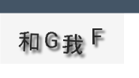

# 写一个验证码view


虽说很少地方用，但是看到稿子上有，写一个备用。

* no picture you say a bird



* show me your code

```java
import android.content.Context;
import android.graphics.Canvas;
import android.graphics.Color;
import android.graphics.Paint;
import android.graphics.Rect;
import android.os.Parcel;
import android.os.Parcelable;
import android.util.AttributeSet;
import android.util.TypedValue;
import android.view.MotionEvent;
import android.view.View;

import java.util.Random;

/**
 * 验证码view
 * Created by xupeng on 2016/4/19.
 */
public class ValiCodeView extends View {

    private static final String TAG = ValiCodeView.class.getSimpleName();
    private final Paint mPaint;

    //保存当前生成的验证码
    private StringBuilder code;
    /**
     * 背景色
     */
    int bgColor;
    /**
     * 源头
     */
    String[] letters = {"我", "人", "有", "的", "和", "F", "G", "0", "1", "2", "3", "4"};
    /**
     * 显示的验证字符数量
     */
    int num;

    /**
     * 是否需要重新生成码
     */
    boolean refresh;
    private final Random mRandom;
    private final Rect mTextBound;

    public ValiCodeView(Context context, AttributeSet attrs) {
        super(context, attrs);
        refresh = true;
        mPaint = new Paint();
        bgColor = Color.parseColor("#F5F5F5");
        num = 4;
        code = new StringBuilder();

        mRandom = new Random();
        mTextBound = new Rect();

    }

    @Override
    protected void onMeasure(int widthMeasureSpec, int heightMeasureSpec) {
        int height = MeasureSpec.getSize(heightMeasureSpec);
        height += getPaddingTop() + getPaddingBottom();
        int size = MeasureSpec.getSize(widthMeasureSpec);
        size += getPaddingLeft() + getPaddingRight();

        setMeasuredDimension(size, height);

    }

    /**
     * 刷新验证码
     */
    public void refreshCode() {
        refresh = true;
        postInvalidate();
    }

    @Override
    protected void onDraw(Canvas canvas) {
        super.onDraw(canvas);

        //背景色
        mPaint.setColor(bgColor);

        canvas.drawRect(0, 0, getMeasuredWidth(), getMeasuredHeight(), mPaint);

        //生成指定数量的随机字母数字
        if (refresh) {
            code.setLength(0);
            for (int i = 0; i < num; i++) {
                final int index = mRandom.nextInt(letters.length);

                code.append(letters[index]);
            }
            refresh = false;
        }


        //绘制验证码

        //字体为斜体
        //   mPaint.setTypeface(Typeface.create(Typeface.DEFAULT, Typeface.ITALIC));
        //字体大小
        mPaint.setTextSize(TypedValue.applyDimension(TypedValue.COMPLEX_UNIT_SP, 20, getContext().getResources().getDisplayMetrics()));


        int count = code.length();
        //单个格子的宽
        float itemW = (getMeasuredWidth() - getPaddingLeft() - getPaddingRight()) * 1.0f / num;

        //设置文字阴影
        mPaint.setShadowLayer(5, 5, 5, Color.parseColor("#4C4C4C"));
        //  int[] colors = {Color.GRAY, Color.CYAN, Color.BLUE, Color.MAGENTA}; //是否需要为每个码设置随机颜色
        for (int i = 0; i < count; i++) {


            mPaint.setColor(Color.parseColor("#272727"));


            final char ch = code.charAt(i);
            float w = itemW / 2 + itemW * i;
            //得到当前要绘制的码的大小
            mPaint.getTextBounds(ch + "", 0, 1, mTextBound);

            w = w < mTextBound.width() / 2 ? mTextBound.width() / 2 : w - mTextBound.width() / 2;

            w += getPaddingLeft();

            canvas.save();
            canvas.rotate(getDegree());
            canvas.drawText(ch + "", w, getHeight() / 2 + mTextBound.height() / 2, mPaint);
            canvas.restore();

        }

    }

    /**
     * 随机获得旋转角度
     *
     * @return
     */
    private int getDegree() {
        return mRandom.nextInt(5) - mRandom.nextInt(4);
    }

    /**
     * 获得验证码字符串内容
     *
     * @return
     */
    public String getCode() {
        return code.toString();
    }

    @Override
    public boolean onTouchEvent(MotionEvent event) {
        if (MotionEvent.ACTION_UP == event.getAction()) {
            //点次刷次
            refreshCode();
        }
        return true;
    }

    @Override
    protected Parcelable onSaveInstanceState() {
        //保存数据
        Parcelable p = super.onSaveInstanceState();
        StateSaved state = new StateSaved(p);
        state.code = code.toString();
        state.refresh = refresh ? 1 : 0;
        return state;
    }

    @Override
    protected void onRestoreInstanceState(Parcelable state) {

        if (!(state instanceof StateSaved)) {
            super.onRestoreInstanceState(state);
            return;
        }
        //还原
        StateSaved saved = (StateSaved) state;
        super.onRestoreInstanceState(saved.getSuperState());
        code = new StringBuilder(saved.code);
        refresh = saved.refresh == 1;
    }

    /**
     * 内部保存当前view数据状态。要想被保存和还原，需要在布局文件中给这个view加一个id。否则 然并软
     */
    public static class StateSaved extends BaseSavedState {
        String code;
        int refresh;

        public StateSaved(Parcel source) {
            super(source);
            code = source.readString();
            refresh = source.readInt();
        }

        public StateSaved(Parcelable superState) {
            super(superState);
        }

        @Override
        public void writeToParcel(Parcel out, int flags) {
            super.writeToParcel(out, flags);
            out.writeString(code);
            out.writeInt(refresh);
        }

        public static final Parcelable.Creator<StateSaved> CREATOR = new Parcelable.Creator<StateSaved>() {
            @Override
            public StateSaved createFromParcel(Parcel source) {
                return new StateSaved(source);
            }

            @Override
            public StateSaved[] newArray(int size) {
                return new StateSaved[size];
            }
        };
    }
}

```