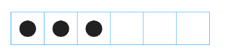

# 自定义方格子editText

* 先看效果


项目中可能会用到，先写上来。根据自己项目要求在做具体修改。

* 直接上码

```java
import android.content.Context;
import android.graphics.Canvas;
import android.graphics.Color;
import android.graphics.Paint;
import android.os.Build;
import android.text.InputFilter;
import android.util.AttributeSet;
import android.view.MotionEvent;
import android.view.inputmethod.EditorInfo;
import android.widget.EditText;

import java.lang.reflect.Field;

/**
 * 方格子输入框
 * Created by xupeng on 2016/4/20.
 */
public class SquareEditText extends EditText {
    private static final String TAG = SquareEditText.class.getSimpleName();
    /**
     * 要画的方格子数量。由maxLength属性控制
     */
    private int num;
    private Paint mPaint;
    private int borderColor; //边框色


    public SquareEditText(Context context, AttributeSet attrs) {
        super(context, attrs);

        //获得最大长度
        final InputFilter[] filters = getFilters();
        for (int i = 0; i < filters.length; i++) {
            final InputFilter filter = filters[i];

            if (filter instanceof InputFilter.LengthFilter) {

                if (Build.VERSION.SDK_INT >= Build.VERSION_CODES.LOLLIPOP) {

                    num = ((InputFilter.LengthFilter) filter).getMax();
                    break;
                }

                try {
                    final Field field = filter.getClass().getDeclaredField("mMax");
                    field.setAccessible(true);
                    num = field.getInt(filter);
                    break;
                } catch (NoSuchFieldException e) {

                } catch (IllegalAccessException e) {

                }
            }
        }

        mPaint = new Paint();
        //默认边框颜色
        borderColor = Color.parseColor("#0094FF");
        //禁止
        setLongClickable(false);

        //横屏时，不显示系统提供的ui
        setImeOptions(EditorInfo.IME_FLAG_NO_EXTRACT_UI);

    }

    //屏蔽点击现操作窗口
    @Override
    public boolean onTouchEvent(MotionEvent event) {
        return false;
    }

    /**
     * 设置边框颜色
     *
     * @param borderColor
     */
    public void setBorderColor(int borderColor) {
        this.borderColor = borderColor;
    }

    @Override
    protected void onDraw(Canvas canvas) {

        if (num == 0) {
            throw new IllegalArgumentException("必须设置maxLength");
        }
        //每个格子的宽度
        final int itemW = getMeasuredWidth() / num;
        //设置边框损色
        mPaint.setColor(borderColor);
        mPaint.setStyle(Paint.Style.STROKE);
        for (int i = 0; i < num; i++) {

            canvas.drawRect(i * itemW, 0, itemW + i * itemW, getMeasuredHeight(), mPaint);

        }
        //设置文字损抽
        mPaint.setColor(getCurrentTextColor());
        mPaint.setStyle(Paint.Style.FILL);

        int len = length();
        //根据内容长度画个圈圈
        for (int i = 0; i < len; i++) {
            final int centre = itemW / 2 + itemW * i;
            canvas.drawCircle(centre, itemW / 2, itemW / 4, mPaint);
        }

    }


}

```

