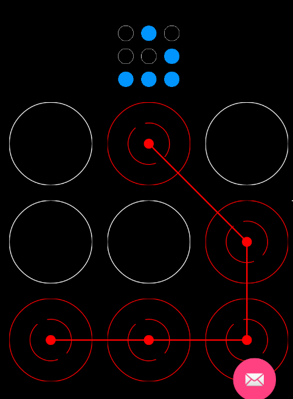
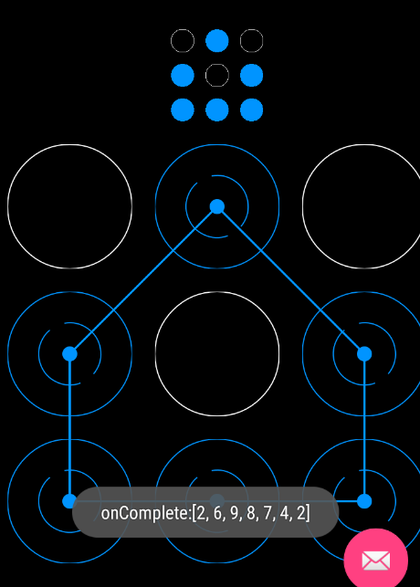

# 自定义手势密码控件

先看效果图





分析实现：
上面的指示部分后面在说，先看主体部分
- 里面的每一个格子是一个单独的自定义view,随便取个名字叫做lockView吧。
这个lockview有四种状态：
  - 普通NORMAL
  - 按下DOWN
  - 错误ERROR
  - 成功SUCCESS
  
  在绘制的时候根据不同状态绘制不同效果。
  
- 外面则是一个viewgroup 取名叫GestureLockView，包裹着9个lockview.乱摸事件处理都在这个viewgroup中。
  
  大概就是这样。下面是具体代码实现.注释相当详细。
  
  
  ```java
  /**
  每一个小格子view
  */
  public class LockView extends View {
    //初始状态
    public static final int NORMAL = 914;
    //鼠标按下
    public static final int DOWN = 669;
    //密码错误
    public static final int ERROR = 873;
    //密码成功
    public static final int SUCCESS = 440;

    private static final String TAG = LockView.class.getSimpleName();

    private
    @Status
    int status = NORMAL;

    private Paint mPaint;


    public LockView(Context context) {
        super(context);
        init();
    }

    public LockView(Context context, AttributeSet attrs) {
        super(context, attrs);

        init();
    }

    private void init() {
        mPaint = new Paint(Paint.ANTI_ALIAS_FLAG);
        mPaint.setStrokeWidth(2);
    }
   

    @IntDef({NORMAL, DOWN, ERROR,SUCCESS})
    @Retention(RetentionPolicy.SOURCE)
    public @interface Status {
    }

    @Override
    protected void onDraw(Canvas canvas) {
        super.onDraw(canvas);

        if (status == ERROR) {
            //密码错误时，状态颜色为红色
            mPaint.setColor(Color.RED);
        }else if (status == DOWN){
          //正在绘制中，状态颜色为绿色
            mPaint.setColor(Color.GREEN);
        }else if (status == SUCCESS){
          //成功
            mPaint.setColor(Color.parseColor("#0094ff"));
        } else {
            mPaint.setColor(Color.WHITE);
        }
        mPaint.setStyle(Paint.Style.STROKE);
        int center = getMeasuredHeight() / 2;
        int radius = getWidth()/2;
        //外圆
        canvas.drawCircle(center, center, radius, mPaint);

        if (status == ERROR || status == SUCCESS) {
            //2条弧
            if (status == ERROR){

                mPaint.setColor(Color.RED);
            }else{
                mPaint.setColor(Color.parseColor("#0094ff"));
            }
            int r = radius / 2;
            RectF rectF = new RectF(center - r, center - r, center + r, center + r);
            canvas.drawArc(rectF, 70, 160, false, mPaint);
            canvas.drawArc(rectF, -100, 140, false, mPaint);
            //实心圆
            mPaint.setStyle(Paint.Style.FILL);
            canvas.drawCircle(center, center, radius / 8, mPaint);
        }

    }

    /** 设置当前view状态 */
    public void setStatus(@Status int status) {
        this.status = status;
        invalidate();
    }
}
  ```
  
 下面是ViewGroup
 
 ```java
 /** 手势密码容器 */
 public class GestureLockView extends ViewGroup {

    private static final String TAG = GestureLockView.class.getSimpleName();
    private int colNum = 3;
    /**
     * 设置的9宫格密码。当前view的id
     */
    private final ArrayList<Integer> passwd = new ArrayList<>();
    /**
     * 当前选择的密码。当前view的id
     */
    private final ArrayList<Integer> choose = new ArrayList<>();
    /**
     * 设置的密码长度
     */
    private int passwdLen;

    /**
     * 以2点为key,它们之间的中间点为value.用于记录是否需要自动连接中间点
     */
    private ArrayMap<String, Integer> betweenMap;

    private LockListener mListener;

    public GestureLockView(Context context, AttributeSet attrs) {
        super(context, attrs);
        betweenMap = new ArrayMap<>();
        //映射2点与中间点
        betweenMap.put("1,3", 2);
        betweenMap.put("1,7", 4);
        betweenMap.put("1,9", 5);
        betweenMap.put("2,8", 5);
        betweenMap.put("3,1", 2);
        betweenMap.put("3,7", 5);
        betweenMap.put("3,9", 6);
        betweenMap.put("4,6", 5);
        betweenMap.put("7,1", 4);
        betweenMap.put("7,3", 5);
        betweenMap.put("7,9", 8);
        betweenMap.put("8,2", 5);
        betweenMap.put("9,1", 5);
        betweenMap.put("9,3", 6);
        betweenMap.put("9,7", 8);


    }

    /** 根据子view来测量 */
    @Override
    protected void onMeasure(int widthMeasureSpec, int heightMeasureSpec) {


        final int widthSize = MeasureSpec.getSize(widthMeasureSpec);
        final int widthMode = MeasureSpec.getMode(widthMeasureSpec);
        final int heightSize = MeasureSpec.getSize(heightMeasureSpec);
        final int heightMode = MeasureSpec.getMode(heightMeasureSpec);

        int resultWidth = 0;
        int resultHeight = 0;

        //添加9格view
        int count = 9;

        //默认margin
        int margin = (int) TypedValue.applyDimension(TypedValue.COMPLEX_UNIT_DIP, 20, getContext().getResources().getDisplayMetrics());
        
        //默认每个小格子宽度
        int itemWidth = 200;

        if (widthMode == MeasureSpec.EXACTLY) {
            itemWidth = widthSize / colNum - margin;
        }


        //在添加子view前先清空
        removeAllViews();

        for (int i = 0; i < count; i++) {
            int row = i / colNum; //当前view所在行
            int col = i % colNum; //当前view所在列

            //创建每个图案
            LockView lockView = new LockView(getContext());
            MarginLayoutParams lp = new MarginLayoutParams(itemWidth, itemWidth);
            lp.leftMargin = margin;
            lp.topMargin = margin;
            //添加一个标记
            lockView.setId(i + 1);

            addView(lockView, lp);

            measureChild(lockView, widthMeasureSpec, heightMeasureSpec);

            if (widthMeasureSpec != MeasureSpec.EXACTLY) {

                //宽度取第一行。每个view宽度相+margin
                if (row == 0) {
                    resultWidth += lockView.getMeasuredWidth() + margin; //左margin
                }
            }
            if (heightMeasureSpec != MeasureSpec.EXACTLY) {
                //高度取第一列的view高+margin
                if (col == 0) {
                    resultHeight += lockView.getMeasuredHeight() + margin; //margin
                }
            }

        }

        resultWidth = resultWidth == 0 ? widthSize : resultWidth;
        resultHeight = resultHeight == 0 ? heightSize : resultHeight;

        setMeasuredDimension(resultWidth, resultHeight);

    }

  /** 按9宫格摆放 */
    @Override
    protected void onLayout(boolean changed, int left, int top, int right, int bottom) {

        final int childCount = getChildCount();

        for (int i = 0; i < childCount; i++) {
            int col = i % colNum;
            int row = i / colNum;

            final View view = getChildAt(i);

            final int childWidth = view.getMeasuredWidth();
            final int childHeight = view.getMeasuredHeight();
            MarginLayoutParams mp = (MarginLayoutParams) view.getLayoutParams();

            int l, t, r, b;
            /*
             计算位置，套一下数值摆摆就知道是什么意思了
             */
            l = col * childWidth + mp.leftMargin * (col + 1);
            t = row * childHeight + mp.topMargin * (row + 1);
            r = childWidth + l;
            b = childHeight + t;

            view.layout(l, t, r, b);

        }

    }


    /**
     * 绘制路径用的
     */
    private Path linePath = new Path();
    /**
     * 当前开始的view
     */
    private LockView currentStartView;

    @Override
    public boolean onTouchEvent(MotionEvent event) {
        int x = (int) event.getX();
        int y = (int) event.getY();
        int count = getChildCount();
        switch (event.getAction()) {
            case MotionEvent.ACTION_DOWN:
                //每次按下时都表示从新开始，清除所有view的状态
                for (int i = 0; i < count; i++) {
                    ((LockView) getChildAt(i)).setStatus(LockView.NORMAL);
                }
                choose.clear();
                linePath.reset();
                //根据按下的xy，获取对应位置的view，有可能按的不在veiw的位置上，所以可能会为null
                currentStartView = getChildByPos(x, y);
                break;
            case MotionEvent.ACTION_MOVE:
                //手指开始乱摸，设置路径线颜色为红色
                linePaint.setColor(Color.RED);

                final LockView currentPosView = getChildByPos(x, y);

                if (currentPosView != null) {
                    //有可能在按下的时候不在正确的view区域，所以会为null
                    if (currentStartView == null) {
                        currentStartView = currentPosView;
                    }
                    //2个view之间是否有需要连接的中间view
                    final int pos = getBetween(currentStartView, currentPosView);


                    if (pos != -1) {
                        //有需要进行连接的中间节点
                        LockView betweenView = (LockView) getChildAt(pos - 1);
                        //设置其选择状态
                        betweenView.setStatus(LockView.DOWN);
                        if (!choose.contains(betweenView.getId())) {
                            //添加到集合
                            choose.add(betweenView.getId());
                        }
                    }


                    int size = choose.size();
                    final int childViewId = currentPosView.getId();

                    //不保存连续相同的密码
                    if ((0 == size) ||
                            (choose.get(size - 1) != childViewId)) {
                        choose.add(childViewId);

                        currentPosView.setStatus(LockView.DOWN);
                    /*
                    这2点的位置在圆心点旁边附近。也可以设置成圆心点。
                    连接点：当手落在当前view上时，连接线要连接的点
                    */
                        start.x = currentPosView.getLeft() / 2 + currentPosView.getRight() / 2;
                        start.y = currentPosView.getTop() / 2 + currentPosView.getBottom() / 2;
                        if (size == 0) {//表示是第一次。设置开头点
                            linePath.moveTo(start.x, start.y);
                        } else {//连接到连接点
                            linePath.lineTo(start.x, start.y);
                        }
                    }
                    /*
                    这里一定要做。不然情况就是 只要经过了对角就会把对角一条线一起选择
                     */
                    currentStartView = currentPosView;
                }
                end.x = x;
                end.y = y;
                break;
            case MotionEvent.ACTION_UP:

                final int size = choose.size();

                //手势结束后，让两点合一，不显示多余的尾巴
                end.x = start.x;
                end.y = start.y;

                //选择的密码数量与设置的密码长度不符合
                if (size != passwdLen) {
                    for (int i = 0; i < size; i++) {
                        ((LockView) getChildAt(choose.get(i) - 1)).setStatus(LockView.ERROR);
                    }
                    if (mListener != null && size > 0) {
                        int[] a = new int[choose.size()];
                        for (int i = 0; i < size; i++) {
                            a[i] = choose.get(i);
                        }
                        mListener.onError(a);
                    }
                } else {
                    boolean isSuccess = true;

                    for (int i = 0; i < size; i++) {
                        final Integer item = choose.get(i);

                        //绘制的路径中只要有一个不对，中判断为错误
                        if (passwd.get(i).intValue() != item.intValue()) {
                            isSuccess = false;
                            break;
                        }
                    }
                    linePaint.setColor(isSuccess ? Color.parseColor("#0094ff") : Color.RED);
                    for (int i = 0; i < size; i++) {
                        final Integer item = choose.get(i);
                        ((LockView) getChildAt(item - 1)).setStatus(isSuccess ? LockView.SUCCESS : LockView.ERROR);
                    }
                    if (isSuccess) {
                        if (mListener != null) {

                            mListener.onSuccess();

                        }
                    } else {

                        if (mListener != null) {
                            int[] a = new int[choose.size()];
                            for (int i = 0; i < size; i++) {
                                a[i] = choose.get(i);
                            }
                            mListener.onError(a);
                        }
                    }
                }

                if (mListener != null ) {
                    int[] a = new int[choose.size()];
                    for (int i = 0; i < size; i++) {
                        a[i] = choose.get(i);
                    }
                    mListener.onComplete(a);
                }
                break;
        }
        invalidate();
        return true;
    }

    /**
     * 根据坐标值，获得view
     *
     * @param x
     * @param y
     * @return
     */
    private LockView getChildByPos(int x, int y) {

        final int childCount = getChildCount();
        for (int i = 0; i < childCount; i++) {
            final LockView child = (LockView) getChildAt(i);

            //x在当前view的宽度范围内，y在当前view的高度范围内

            if ((x >= child.getLeft()) && (x <= child.getRight())
                    && (y >= child.getTop()) && (y <= child.getBottom())) {

                final int radiusX = child.getMeasuredWidth() / 2;
                final int radiusY = child.getMeasuredHeight() / 2;
                int centerX = child.getRight() - radiusX;
                int centerY = child.getBottom() - radiusY;
                /*
                 求点是否在圆上。公式：
                    到圆心的距离 是否大于半径。半径是R  如O(x,y)点圆心，任意一点P（x1,y1） （x-x1）*(x-x1)+(y-y1)*(y-y1)>R*R 那么在圆外 反之在圆内

                     手指经过当前view时，如果是在圆内，则判定有效，如果是在当前view的四边角但是没有在圆的范围内，则无效
                 */

                if (!((centerX - x) * (centerX - x) + (centerY - y) * (centerY - y) > radiusX * radiusX)) {

                    return child;
                }

            }
        }
        return null;
    }

    /**
     * 计算两个view之间是否有需要连接的中间view.<br/>
     * eg:如果点的3，拖到7，成对角，那么中间需要自动连接的就是5
     *
     * @param start
     * @param end
     * @return 返回中间view在父view的位置。没有就返回-1
     */
    private int getBetween(LockView start, LockView end) {
        int s = getPosByView(start);
        int e = getPosByView(end);
        if (s == -1 || e == -1) {
            return -1;
        }
        Integer betweenPos = getBetweenPosByKey("" + s + "," + e);

        return betweenPos == null ? -1 : betweenPos;
    }

    /**
     * 根据key，查找中间值。<br/>
     * eg:key="3,7",value=5
     *
     * @param key
     * @return value
     */
    private Integer getBetweenPosByKey(String key) {
        return betweenMap.get(key);
    }

    /**
     * 根据view计算其在父view中所在位置
     *
     * @param view
     * @return 没有返回-1
     */
    private int getPosByView(LockView view) {
        final int childCount = getChildCount();
        for (int i = 0; i < childCount; i++) {
            if (getChildAt(i) == view) {
                return (i + 1);
            }
        }
        return -1;
    }

    private Paint linePaint = new Paint();
    private Point start = new Point();
    private Point end = new Point();

    @Override
    protected void dispatchDraw(Canvas canvas) {
        super.dispatchDraw(canvas);

        linePaint.setStyle(Paint.Style.STROKE);
        linePaint.setStrokeWidth(4);

        //绘制连接线
        canvas.drawPath(linePath, linePaint);

        if (choose.size() > 0) {
            if (end.x != 0 && end.y != 0) {

                //这个主要是当手势落在某个view上时，能自动把点定位连接到view的连接点
                canvas.drawLine(start.x, start.y, end.x, end.y, linePaint);
            }
        }
    }

    /**
     * 设置密码
     *
     * @param pwd
     */
    public void setPasswd(int[] pwd) {
        this.passwdLen = pwd.length;
        this.passwd.clear();
        for (int i = 0; i < this.passwdLen; i++) {
            this.passwd.add(pwd[i]);
        }

    }

    @Override
    protected LayoutParams generateLayoutParams(LayoutParams p) {
        return new MarginLayoutParams(p);
    }

    public void setListener(LockListener listener) {
        mListener = listener;
    }

    public interface LockListener {
        void onComplete(int[] a);
        void onSuccess();
        void onError(int[] integers);
    }
}
 ```
  
  